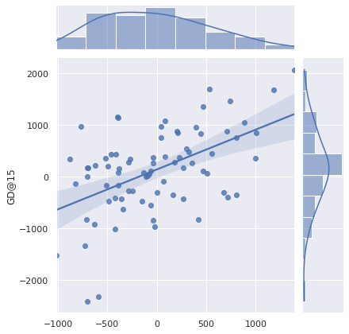
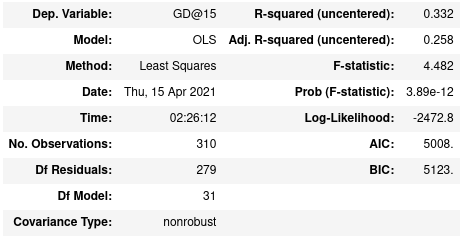

# Estimating Gold Difference in G2 E-Sports match ups

In the game of League of Legends, players can purchase items during a match with gold they earn by playing well. As a result, the amount of gold earned and the
amount by which one team's gold amount differs from the opposing team's gold often determines the strength of the players as the game goes on. Strong players very
often result in a match win, barring some catastrophic misplay. G2 Esports is considered the top team in the European league, and their consistent play with varied
champion compositions provides for a varied yet clean dataset.

Here, we take stats obtained from [Games of Legends Database](https://gol.gg/esports/home/), using a combination of BeautifulSoup and Selenium, to manufacture
data tables and then use those tables to train Linear Models that predict Gold Difference. 

Preliminary models can be summarized by the following:

Although these results are promising, these are still preliminary results and proposed problem can benefit from experimentation involving different regression models
and regularization methods.
