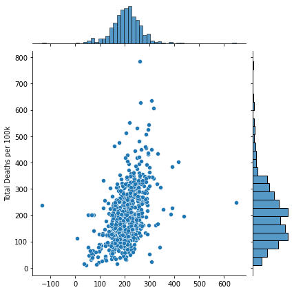

### Minimum Viable Product to determine Total COVID-19 Deaths across US Counties

The point of this project is to take readily available data and determine how many mortalities are occuring throughout the United States.

I used a Linear Regression model with least squares method of determining error and learning. Due to the volume of data, it's too difficult to label each point
on the graph, but each point corresponds to a county in a particular state in the USA.

Initial results suggest that that our results are trending in the same manner as the actual number of COVID deaths. However, the predictions are more 
normally distributed than the actual results. Further work done in modeling will include removing outliers in the results, so our predictions are less influenced
by the extreme values.
